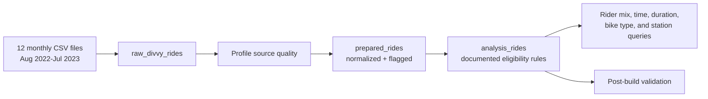

# Chicago Bike-Share Rider Analysis

A reproducible PostgreSQL case study comparing member and casual rider behavior in Chicago bike-share trip data. The project turns a one-file exploratory query into an auditable workflow for data profiling, quality controls, customer segmentation, and conversion-focused marketing recommendations.

> Portfolio note: this independent analysis is not affiliated with or endorsed by Lyft, Divvy, or the City of Chicago. The Divvy name is used only to identify the public data source.

## Business question

How do annual members and casual riders use the bike-share service differently, and which observable patterns could inform campaigns that encourage eligible casual riders to consider membership?

This project demonstrates:

- staged PostgreSQL transformations instead of a single opaque query;
- explicit data-quality flags and validation checks;
- corrected duration logic for rides that cross midnight;
- preservation of raw and normalized station names for auditability; and
- a clear path from behavioral findings to testable marketing actions.

## Analysis workflow



## Published findings

The original 2023 analysis reported the following patterns. These are historical results from the linked Tableau and Medium work—not newly computed claims from the refreshed SQL branch.

| Observation | Reported pattern | Marketing implication |
| --- | --- | --- |
| Rider mix | Members accounted for 64.8% of analyzed trips. | Focus conversion work on identifiable, repeat casual riders rather than broad untargeted reach. |
| Day and hour | Members were more active on weekdays and around commute hours; casual riders skewed toward weekends and afternoons. | Separate commuter-oriented and leisure-oriented campaign tests. |
| Seasonality | Usage was higher in warmer months. | Time conversion messaging before and during peak seasonal demand. |
| Duration | Casual riders generally took longer rides than members. | Test membership value messages against frequent, longer-duration casual use. |
| Location | Activity concentrated around central Chicago neighborhoods and high-volume stations. | Pilot location-specific campaigns before expanding citywide. |

The original analysis also identified **Streeter Dr & Grand Ave** as the leading station and suggested commuter, weekend, summer, and location-based campaign concepts. These observations are hypotheses for targeting and experimentation—not proof of why riders behave as they do.

## Dashboard preview

[](https://public.tableau.com/app/profile/mark.cruz4539/viz/CaseStudyDivvy/Story1)

*Live preview from the original Tableau story. Open the image to explore all story points.*

## Reproduce the analysis

Prerequisites: PostgreSQL and the 12 Divvy monthly trip files from August 2022 through July 2023.

```bash
createdb divvy_case_study
psql -d divvy_case_study -f sql/00_create_source_table.sql
```

Import each CSV into `raw_divvy_rides`, then run:

```bash
psql -d divvy_case_study -f data_cleaning.sql
```

The compatibility entry point runs profiling, preparation, analysis, and validation in order. See the [full reproducibility guide](docs/reproducibility.md) for import examples, the expected source schema, and an option for migrating the original combined table.

## Repository structure

| Path | Purpose |
| --- | --- |
| [`sql/00_create_source_table.sql`](sql/00_create_source_table.sql) | Defines the raw import contract. |
| [`sql/01_profile_source.sql`](sql/01_profile_source.sql) | Measures duplicates, nulls, category values, endpoint gaps, and duration anomalies. |
| [`sql/02_build_prepared_rides.sql`](sql/02_build_prepared_rides.sql) | Normalizes station labels, fixes duration math, adds quality flags, and creates the analysis view. |
| [`sql/03_analysis.sql`](sql/03_analysis.sql) | Produces rider mix, temporal, duration, bike-type, and station summaries. |
| [`sql/04_validate_pipeline.sql`](sql/04_validate_pipeline.sql) | Checks the analysis view for duplicate IDs, missing required fields, and invalid records. |
| [`docs/methodology.md`](docs/methodology.md) | Documents decisions, assumptions, limitations, and changes from the original query. |
| [`docs/data-dictionary.md`](docs/data-dictionary.md) | Describes the raw, prepared, and analysis fields. |
| [`archive/data_cleaning_original.sql`](archive/data_cleaning_original.sql) | Preserves the original 2023 exploratory SQL for provenance. |

Raw trip files are deliberately excluded from this repository.

## Recommended next experiments

1. Define “frequent casual rider” using a privacy-safe, approved aggregation rather than assuming identity from anonymous trip records.
2. Test commute-value messaging against leisure-oriented messaging with a predeclared primary conversion metric.
3. Pilot geo-targeted campaigns near high-volume stations and compare lift with matched control locations.
4. Join app, web, and email engagement only when consent, governance, and identity-resolution rules allow it.
5. Re-run the refreshed SQL on the historical snapshot and publish a versioned results export before comparing exact figures with the 2023 analysis.

## Data source and usage

Historical trip data is available from the official [Divvy Data page](https://divvybikes.com/system-data) and is governed by the [Divvy Data License Agreement](https://divvybikes.com/data-license-agreement). The source files are not redistributed here. Consult the current agreement before downloading or using the data.

The SQL and repository documentation are available under the [MIT License](LICENSE). That license does **not** apply to the underlying trip data, third-party trademarks, Tableau, Medium, or Google Slides content.

## Related work

- [Background and cleaning write-up](https://medium.com/@markcastillocruz/data-analysis-case-study-divvy-bikes-chicago-e5e54b5873f3)
- [Visualizations and recommendations write-up](https://medium.com/@markcastillocruz/data-analysis-case-study-divvy-2-2-687856d3a9e8)
- [Presentation deck](https://docs.google.com/presentation/d/1iyvfBZdN74AFRKZwt4K4MEXvGuOVVgMo2P-02dOjIxw/edit?usp=sharing)
- [Interactive Tableau story](https://public.tableau.com/app/profile/mark.cruz4539/viz/CaseStudyDivvy/Story1)
- [LinkedIn profile](https://www.linkedin.com/in/markcastillocruz/)
