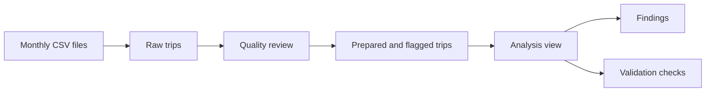

# Chicago Bike-Share Rider Analysis

A PostgreSQL and Tableau case study that examines data quality and compares how
annual members and casual riders used Chicago's bike-share service.

This independent analysis is not affiliated with or endorsed by Lyft, Divvy,
or the City of Chicago. The Divvy name identifies the public data source.

## Review this project in 3 minutes

No setup is required:

1. Read the [business question](#business-question) and
   [historical findings](#historical-findings).
2. Open the [interactive Tableau story](https://public.tableau.com/app/profile/mark.cruz4539/viz/CaseStudyDivvy/Story1).
3. Review the [methodology](docs/methodology.md) or
   [validation checks](sql/04_validate_pipeline.sql) for technical evidence.

## Business question

How did annual members and casual riders use the service differently, and which
observable patterns could support marketing tests that encourage eligible
casual riders to consider membership?

The analysis describes behavior in the trip data. It does not identify
individual riders or prove why they made a trip.

## How the analysis works

1. Load twelve monthly CSV files into a raw PostgreSQL table.
2. Profile duplicates, missing values, station fields, categories, and duration
   problems.
3. Normalize the data while preserving the original fields for review.
4. Apply documented rules that determine which trips are eligible for analysis.
5. Compare rider mix, time, duration, bike type, and station activity.
6. Run validation checks against the final analysis view.



## What this demonstrates

- Staged SQL transformations instead of one opaque query.
- Visible data-quality flags and final validation checks.
- Correct duration calculation for rides that cross midnight.
- Preserved raw and normalized station fields for auditability.
- A documented path from observed patterns to testable marketing ideas.

## Historical findings

The original 2023 analysis reported these patterns. They come from the linked
Tableau and Medium work and have not been recomputed from the refreshed SQL
pipeline.

| Observation | Reported pattern | Possible marketing test |
| --- | --- | --- |
| Rider mix | Members represented 64.8% of analyzed trips | Focus on repeat casual use rather than broad untargeted reach |
| Day and hour | Members were more active on weekdays and near commute hours; casual riders favored weekends and afternoons | Compare commuter and leisure messages |
| Seasonality | Usage increased in warmer months | Time campaigns around seasonal demand |
| Duration | Casual riders generally took longer rides | Test membership value for frequent longer trips |
| Location | Activity concentrated around central neighborhoods and busy stations | Pilot location-specific campaigns before expanding |

The original analysis also identified **Streeter Dr & Grand Ave** as the leading
station. These findings suggest experiments; they do not establish why riders
behaved differently or guarantee a campaign result.

## Dashboard

[](https://public.tableau.com/app/profile/mark.cruz4539/viz/CaseStudyDivvy/Story1)

Open the image to explore the full Tableau story.

## Optional reproduction

Reproducing the analysis requires PostgreSQL and the twelve external monthly
trip files from August 2022 through July 2023. The source files are not included
in this repository.

The SQL runs in four stages:

```text
sql/01_profile_source.sql
sql/02_build_prepared_rides.sql
sql/03_analysis.sql
sql/04_validate_pipeline.sql
```

After importing the CSV files into `raw_divvy_rides`, run:

```bash
createdb divvy_case_study
psql -d divvy_case_study -f sql/00_create_source_table.sql
psql -d divvy_case_study -f data_cleaning.sql
```

Success means every integrity check in the final output reports `PASS`. See the
[reproducibility guide](docs/reproducibility.md) for installation, CSV import,
expected schema, and troubleshooting.

## Limits and next steps

- Historical figures should not be presented as newly recomputed results.
- Anonymous trip records cannot safely establish repeat-rider identity.
- Observed patterns do not prove motivation or marketing effectiveness.
- A future version should rerun the refreshed pipeline on a versioned data
  snapshot and publish a validated results export.
- Campaign ideas should be tested with a defined success metric, appropriate
  comparison group, and approved privacy and consent rules.

## Project guide

- [Methodology](docs/methodology.md)
- [Reproducibility](docs/reproducibility.md)
- [Data dictionary](docs/data-dictionary.md)
- [Original exploratory SQL](archive/data_cleaning_original.sql)
- [Interactive Tableau story](https://public.tableau.com/app/profile/mark.cruz4539/viz/CaseStudyDivvy/Story1)

## Data and license

Trip data is available from the official
[Divvy Data page](https://divvybikes.com/system-data) and is governed by the
[Divvy Data License Agreement](https://divvybikes.com/data-license-agreement).
Consult the current agreement before downloading or using the data.

Repository code and documentation are available under the [MIT License](LICENSE).
That license does not cover the source trip data, third-party trademarks,
Tableau, Medium, or Google Slides content.
